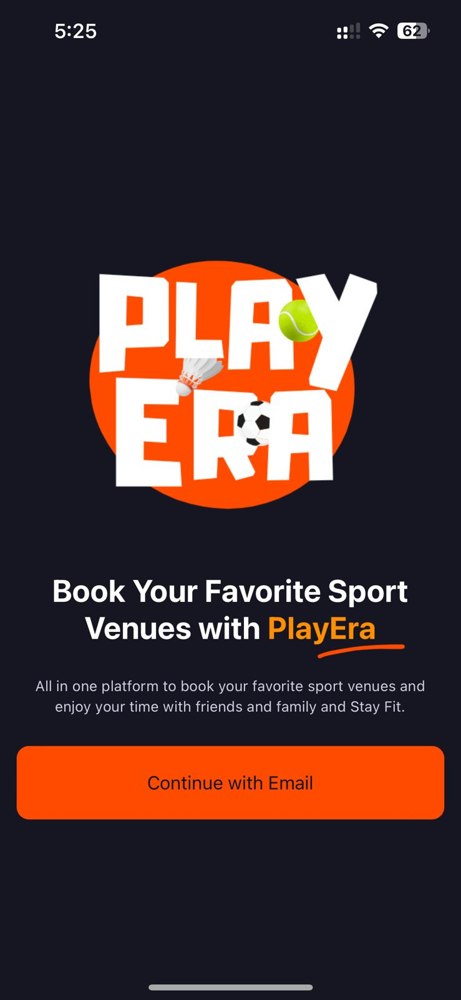
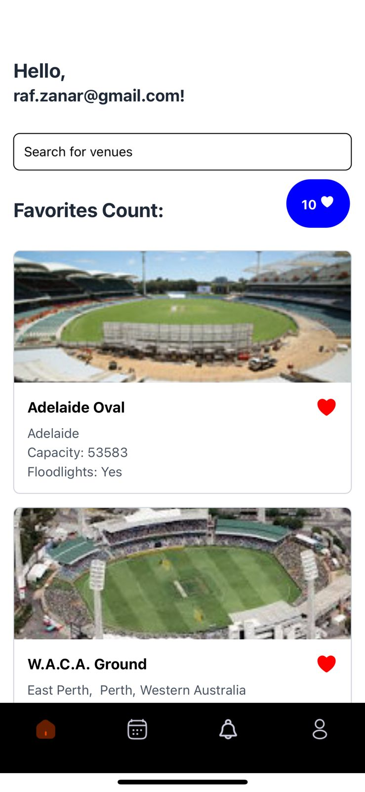
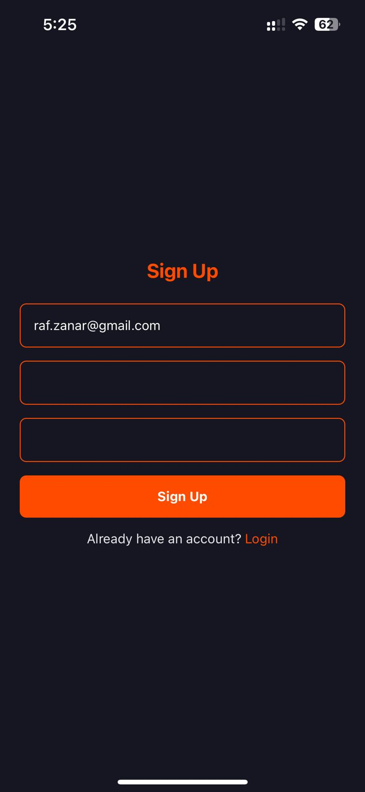
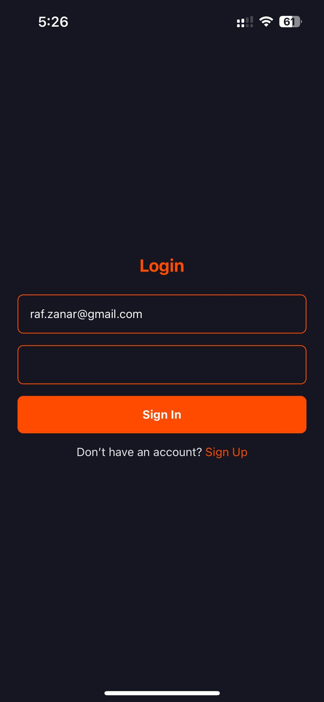

Here’s a `README.md` file for your project. It includes an overview, setup instructions, features, and a guide to run the app.

---

## **Cricket Venues App**

A React Native application built with Expo, providing a list of cricket venues with search functionality, favorite management, and user authentication using Firebase.

---

### **Features**

- **User Authentication**:
  - Firebase Authentication for sign-up and sign-in.
  - Personalized greeting with the user's email.
- **Venue Listing**:
  - Fetches cricket venues from the SportMonks API.
  - Search functionality by venue name or city.
- **Favorites Management**:
  - Add venues to favorites with a floating button displaying the total count.
- **Responsive Design**:
  - Optimized for both iOS and Android devices.

---

### **Prerequisites**

- Node.js and npm installed.
- Expo CLI installed globally (`npm install -g expo-cli`).
- Firebase project set up. (Follow [Firebase setup](https://firebase.google.com/docs) to configure.)

---

### **Installation**

1. **Clone the Repository**:
   ```bash
   git clone https://github.com/your-username/cricket-venues-app.git
   cd cricket-venues-app
   ```

2. **Install Dependencies**:
   ```bash
   npm install
   ```

3. **Set Up Firebase**:
   - Create a Firebase project in the [Firebase Console](https://console.firebase.google.com/).
   - Enable **Email/Password Authentication** under **Authentication**.
   - Copy your Firebase configuration and paste it into the `firebase.js` file:
     ```javascript
     import { initializeApp } from "firebase/app";
     import { getAuth } from "firebase/auth";

     const firebaseConfig = {
       apiKey: "YOUR_API_KEY",
       authDomain: "YOUR_AUTH_DOMAIN",
       projectId: "YOUR_PROJECT_ID",
       storageBucket: "YOUR_STORAGE_BUCKET",
       messagingSenderId: "YOUR_MESSAGING_SENDER_ID",
       appId: "YOUR_APP_ID",
     };

     const app = initializeApp(firebaseConfig);
     export const auth = getAuth(app);
     ```

4. **Add API Token**:
   - Replace `YOUR_API_TOKEN` in the API URL with your SportMonks API token in `HomeScreen.js`:
     ```javascript
     const API_URL = "https://cricket.sportmonks.com/api/v2.0/venues?api_token=YOUR_API_TOKEN";
     ```

5. **Run the App**:
   ```bash
   expo start
   ```

---


### **Usage**

1. **Sign Up / Sign In**:
   - Navigate to the sign-up or sign-in screen.
   - Use your email and password to create an account or log in.

2. **View Venues**:
   - Browse the list of cricket venues.
   - Use the search bar to filter venues by name or city.

3. **Manage Favorites**:
   - Click the heart icon on a venue card to add it to favorites.
   - View the total count of favorites in the floating button.

---

### **Technologies Used**

- **React Native**: Framework for building mobile apps.
- **Expo**: Development toolchain for React Native.
- **Firebase**: Backend for user authentication.
- **SportMonks API**: Data source for cricket venues.

---

### **API Reference**

- **SportMonks API**:
  - URL: `https://cricket.sportmonks.com/api/v2.0/venues`
  - Authentication: Use the API token provided by SportMonks.

---

### **Screenshots**

### Onboarding Screen


### Home Screen


### Sign In Screen


### Sign Up Screen


---

### **License**

This project is licensed under the MIT License.
